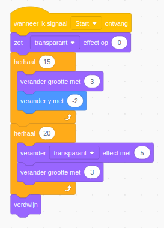

# Test plans

Test plans are used to test submissions for Scratch exercises.
While intimate knowledge of the judge is not required, it can be useful to look at the source code in case of doubt.

## Structure

A test plan is split into three main stages:

1. `beforeExecution` - Executed before the Scratch VM is run.
2. `duringExecution` - Used to drive the test plan.
3. `afterExecution` - Executed after the solution has been executed.

In the `beforeExecution` stage, you have access to the solution and the starter version of the exercise.
While the Scratch VM has not yet run, you do have access to all sprites and code.
The access to the starter version of the exercise is useful to perform checks to verify that predefined blocks did not change.

The stages are implemented as a function, which will be called by the judge at the right moment.
For example, the `beforeExecution` is as follows:

```javascript
/**
 * @param {Evaluation} e
 */
function beforeExecution(e) {
  // Access the submission
  e.log.submission;
  // Access the starter version.
  e.log.template;
}
```

The signature of the other stages is the same.

The `duringExecution` stage is mainly used to drive the Scratch VM by using the scheduler.
The scheduler takes the place of the human;
it will click on sprites, it will send broadcasts, do key presses, etc.

For example, it is very common to send the green flag broadcast.

Finally, the `afterExecution` stage is run after the submission has been run.
Here, you have access to the captured log, so tests on what happens are possible.

## Before execution

This phase is meant for static tests, where execution of the submission is not necessary.

One of the most common tests is the test for the predefined blocks.
Students often change the predefined blocks or change the code of other sprites.
Since other tests rely on the predefined blocks to work, we need to make sure they actually work.

Since this is used so often, there is built-in support for checking the predefined blocks.
The documentation is available at TODO.
An example of this is the following snippet:

```javascript
function beforeExecution(e) {
  Itch.checkPredefinedBlocks(
    {
      hats: {
        Planet: [stack(whenIReceive('Start'), setSizeTo(anything()))]
      },
    },
    e
  );
}
```

The built-in checks work by comparing the blocks of the submission to the blocks of the template.
However, since students must add blocks somewhere, we must define where students are allowed to add blocks.

In the example above, we allow blocks to be added to the "Planet" sprite,
in a block stack starting with the hat _When I receive broadcast "Start"_,
followed by a block "Set size to", with any argument.


## During execution

Here, the main purpose is to simulate user interaction.
For example, you often want to press the green flag.

A simple example is:

```javascript
function duringExecution(e) {
  e.scheduler
    .greenFlag(false)
    .sendBroadcast('Start', false)
    .wait(1000);
}
```

In this example, we press the green flag (and don't wait for execution to end),
then send a broadcast "Start" (again not waiting for the execution to end),
and finally we wait 1000 ms (so 1 second).

The reference documentation for the scheduler is available at [].


## After execution

After the VM has stopped executing, you can access the log to inspect what happened (e.g. postmortem tests).

See the docs of the log for more details on available data.

## Globals

The test plan is a traditional javascript file, not a module (unfortunately).
This means you cannot import functions or other constructs.
Therefore, some global methods are available.
These are documented in the type declaration at [].

## Matching blocks

In various places of the test plan, you might want to match blocks.
To make things easier, a block API exists;
a kind of DSL to match with blocks.

Most matching functions accept a pattern.
A pattern supports the usual techniques:

- Wildcards (with `anything()`).
- Choices (with a list).
- Exact matches.

For example, consider the following block stack:



Can be represented as such by the API:

```javascript
stack(
  whenIReceive('Start'),
  setEffectTo(transparent(), 0),
  repeat(15, stack(
    changeSizeBy(3),
    changeYBy(-2), 
  )),
  repeat(20, stack(
    changeEffectBy(transparent(), 5),
    changeSizeBy(3)
  )),
  hide()
)
```


For most blocks, an equivalent function exists (see the source file).
Three special functions are:

- `stack()`: Indicate a block stack.
- `anything()`: Matches anything.
- `nothing()`: Matches nothing.
